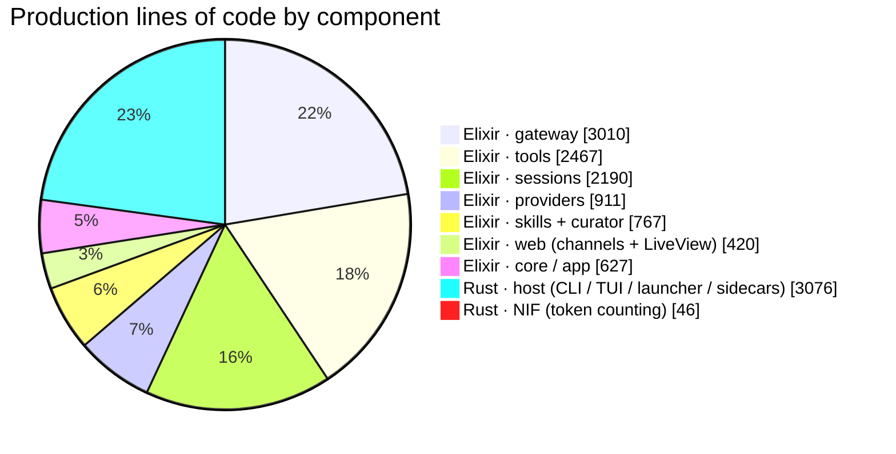
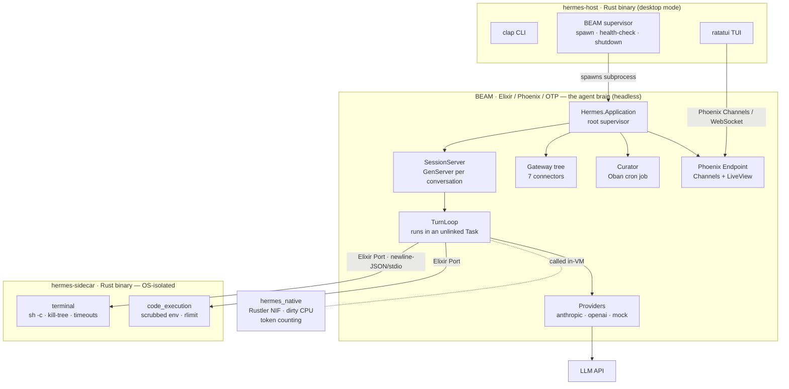
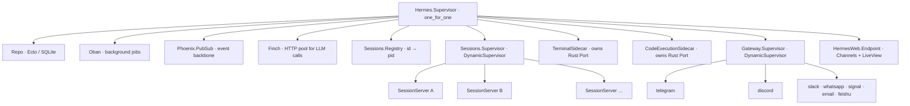
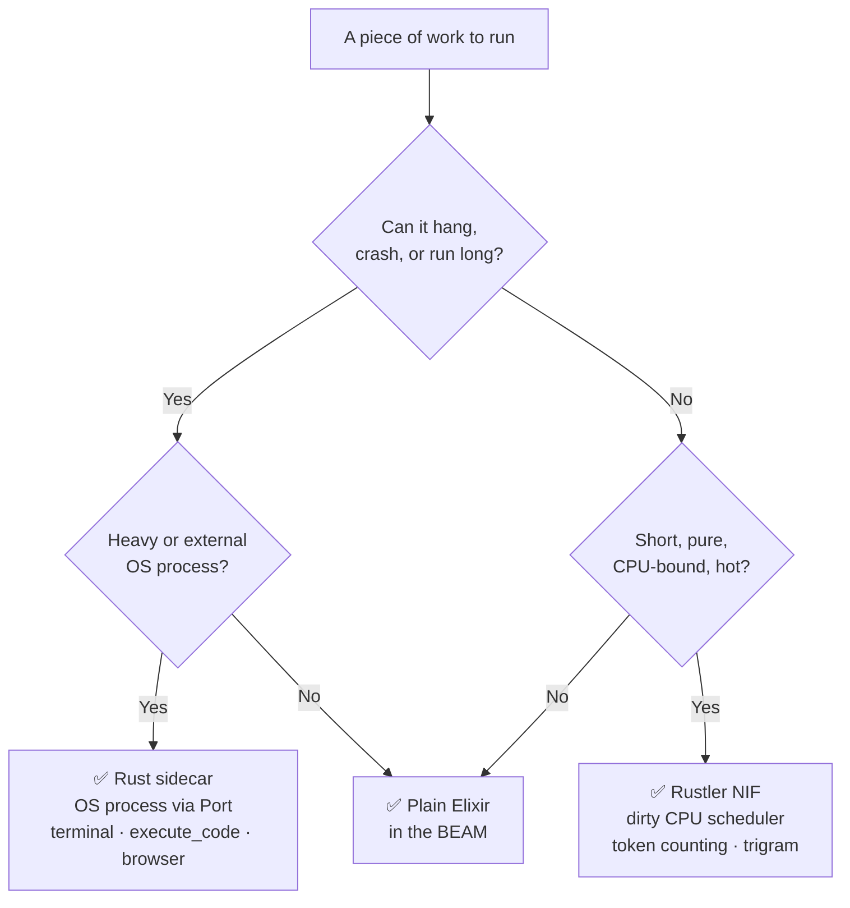
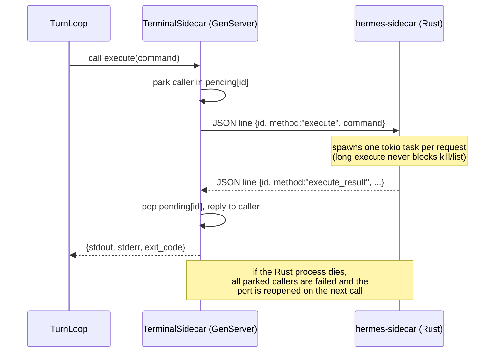
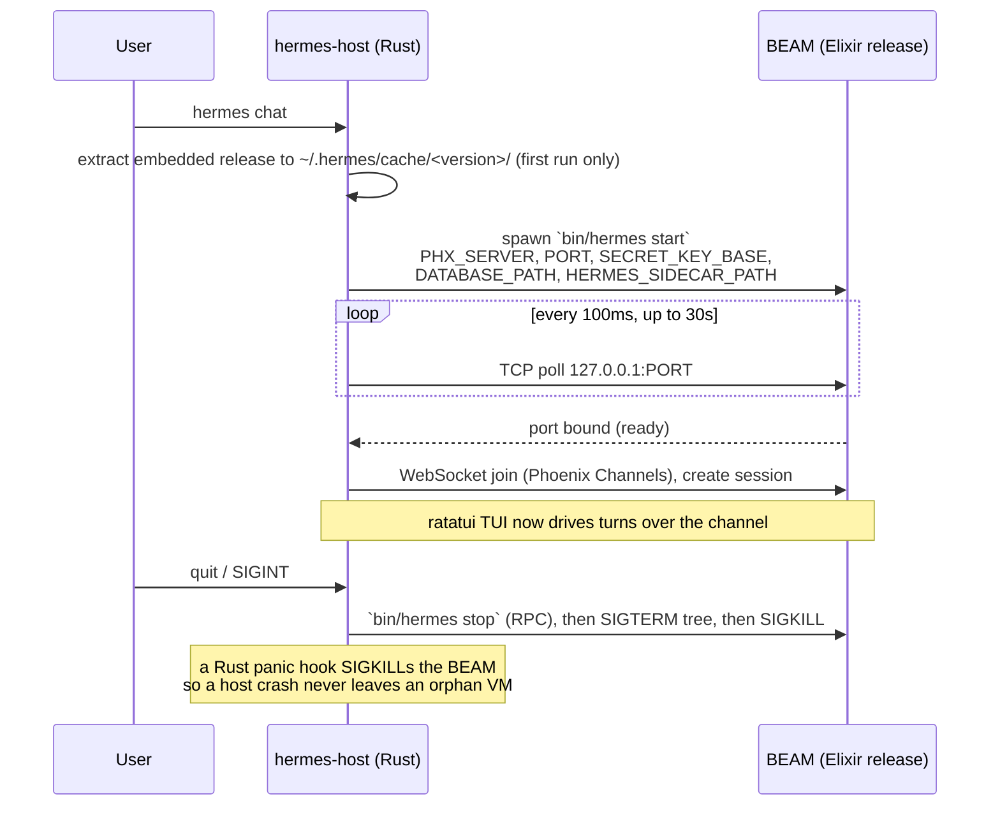
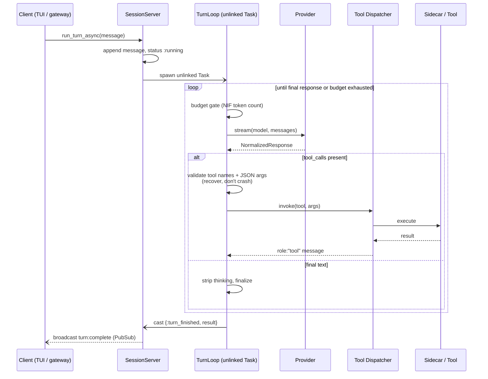
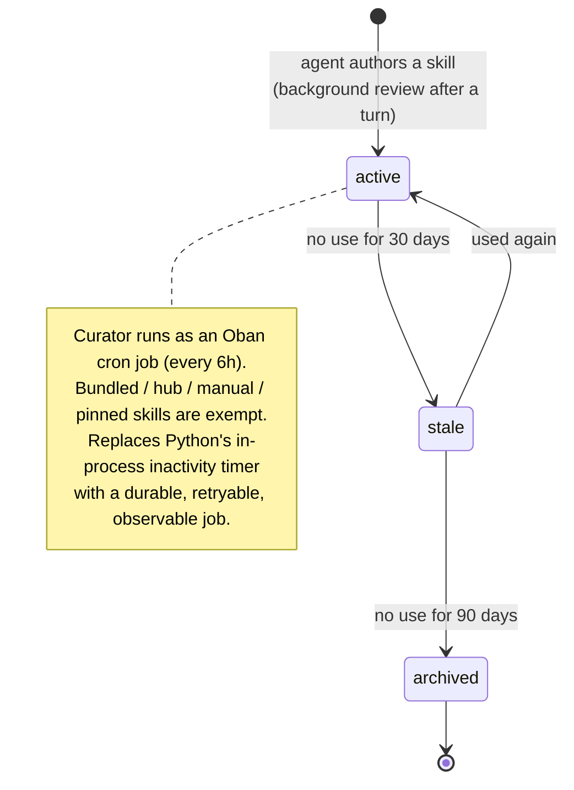
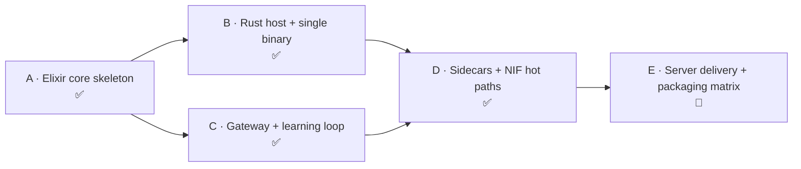

# Hermes (Rust + Elixir)

A reimplementation of the [Nous Research **Hermes**](https://github.com/NousResearch) persistent
personal AI agent, ported from a ~1.16M-LOC Python/TypeScript codebase to an **Elixir/Phoenix
orchestration core** wrapped in a **Rust host binary**, with **Rustler NIFs** for hot-path compute and
**Rust sidecar processes** for crash-prone work.

This document explains how the port was done, how the Rust ↔ Elixir boundary works (NIFs *and*
sidecars), exactly how much code lives on each side, and a full feature-parity matrix of what was
ported, what is new, and what is still missing.

---

## Contents

- [TL;DR — what changed and why](#tldr--what-changed-and-why)
- [Codebase at a glance (lines of code)](#codebase-at-a-glance-lines-of-code)
- [Architecture at a glance](#architecture-at-a-glance)
- [The Rust ↔ Elixir boundary: NIF vs. sidecar](#the-rust--elixir-boundary-nif-vs-sidecar)
- [The Rust host: launching and supervising the BEAM](#the-rust-host-launching-and-supervising-the-beam)
- [The Elixir core: how a turn actually runs](#the-elixir-core-how-a-turn-actually-runs)
- [The learning loop (the differentiator)](#the-learning-loop-the-differentiator)
- [Feature parity vs. the original](#feature-parity-vs-the-original)
- [Configuration](#configuration)
- [Building & running](#building--running)
- [Phased rewrite plan & current status](#phased-rewrite-plan--current-status)
- [Repository layout](#repository-layout)

---

## TL;DR — what changed and why

| | Original Hermes | This rewrite |
|---|---|---|
| **Brain** | Python (`AIAgent` core, ~1.16M LOC, 2,470 `.py` files) | **Elixir / Phoenix / OTP** |
| **Sessions** | asyncio tasks + thread pool + agent LRU cache | **One `GenServer` per session under a `DynamicSupervisor`** |
| **Fault isolation** | in-process; one crash can poison the loop | **OTP supervision** — a session crash can't touch siblings or the VM |
| **Outer shell / CLI** | Python `cli.py` (~15K LOC) + Electron + bootstrap installer | **Rust `hermes-host` binary** (CLI + launcher + supervisor) |
| **TUI** | Ink 6 + React 19 (TypeScript) | **ratatui** (Rust, owns the terminal fd natively) |
| **Wire protocol** | 3 transports: TUI JSON-RPC broker, ACP JSON-RPC, web REST | **One** — Phoenix **Channels over localhost WebSocket** |
| **Crash-prone tools** (`terminal`, `execute_code`) | in-process Python `subprocess` | **OS-isolated Rust sidecars** (Ports), never NIFs |
| **Hot compute** (token counting) | pure Python | **Rustler NIF on dirty CPU schedulers** |
| **Background jobs** | inactivity timer at session start | **Oban** (durable, retryable, cron) |
| **Curator** | in-process timer (168h interval, 2h min-idle) | **Oban cron job** (every 6h) |
| **Persistence** | SQLite `state.db` (direct) | **Ecto** over SQLite (`ecto_sqlite3`) |
| **Search** | SQLite FTS5 (unicode61 + CJK trigram), zero embeddings | **Same** — FTS5 kept, no pgvector in Phase 1 |
| **Packaging** | Docker / Nix / Homebrew / install scripts (no single binary) | **One fat binary** embedding a zstd-compressed `mix release` |
| **Connectors** | ~31 (11 built-in + 20 plugin) | **7 Tier-1** kept; rest deferred |

The thesis: **let each runtime do what it is best at.** Elixir/OTP gives per-session fault isolation,
cheap concurrency, supervision, PubSub, and durable jobs essentially for free — which is exactly the
shape of an agent runtime that juggles many long-lived conversations and flaky external connectors.
Rust owns the things the BEAM is bad at or shouldn't touch: a native terminal UI, a single shippable
binary, and OS-level process isolation for untrusted command/code execution.

---

## Codebase at a glance (lines of code)

The whole system — agent brain, host, sidecars, NIF, gateway, and learning loop — is **~13.5K lines
of production code** (plus ~7K of tests/config). Compare that to the ~1.16M-LOC Python original: the
rewrite is a *focused Phase-1 port* of the irreducible core, not a line-for-line translation.

| Component | Language | Files | Lines |
|---|---|---|---|
| `lib/hermes/gateway` — connector tree (7 platforms) | Elixir | 11 | 3,010 |
| `lib/hermes/tools` — registry, dispatcher, tools, sidecar clients | Elixir | 12 | 2,467 |
| `lib/hermes/sessions` — SessionServer, TurnLoop, Search, schemas | Elixir | 11 | 2,190 |
| `lib/hermes/providers` — transport behaviour + anthropic/openai/mock | Elixir | 5 | 911 |
| `lib/hermes/skills` — manager / provenance / telemetry | Elixir | 4 | 607 |
| `lib/hermes/curator` — Oban worker + background review | Elixir | 2 | 160 |
| `lib/hermes_web` — Phoenix channels + LiveView dashboard | Elixir | 10 | 420 |
| `lib/hermes` — application, supervision, native loader, repo | Elixir | 11 | 627 |
| `host/src` — CLI, ratatui TUI, BEAM supervisor, **sidecars** | Rust | 14 | 3,076 |
| `host/native/src` — **the Rustler NIF** (token counting) | Rust | 1 | 46 |
| **Production total** | | **81** | **13,514** |
| `test/` (Elixir) | Elixir | 25 | 5,267 |
| `host/tests` (Rust) | Rust | 8 | 1,804 |
| `config/` | Elixir | 4 | 278 |
| **Grand total (incl. tests + config)** | | **118** | **20,863** |

Production split: **Elixir 10,392 (77%) · Rust 3,122 (23%)**. The Rust footprint is small and
deliberate — it does only what must be native (launcher, TUI, OS isolation, hot math). Note how tiny
the **NIF** is (46 lines): the architecture rule is to keep NIFs minimal, because code inside the BEAM
can crash the whole VM.



---

## Architecture at a glance

There are **three** distinct Rust pieces. Keeping them straight is the key to understanding the port:

1. **`host/`** — the `hermes-host` binary. Launcher, supervisor, and ratatui TUI. Lives *outside* the BEAM.
2. **`host/bin/sidecar.rs`** — the `hermes-sidecar` binary. Untrusted work in its own OS process; talks to the BEAM over a Port. Lives *outside* the BEAM.
3. **`host/native/`** — the `hermes_native` crate, a Rustler `cdylib`. Loaded *inside* the BEAM as a NIF.



> In **server mode** the Rust host disappears entirely: the same Elixir release runs as a plain
> headless BEAM under systemd/Docker. Same brain, two delivery modes. (**Burrito is not used** —
> Burrito makes the BEAM the host; here Rust is the host.)

### The OTP supervision tree

The single biggest structural change from the Python original is that **everything is a supervised
process**. `Hermes.Application` boots a `:one_for_one` root supervisor; each conversation is its own
`SessionServer` under a `DynamicSupervisor`, so a crash in one session cannot affect another or the
VM. The same pattern isolates each gateway connector.



---

## The Rust ↔ Elixir boundary: NIF vs. sidecar

This is the single most important design rule in the port, lifted from
[`05-architecture-map.md`](05-architecture-map.md) and [`07-rewrite-execution-spec.md`](07-rewrite-execution-spec.md):

> **NIFs are short, pure, CPU-bound compute on dirty schedulers. Anything heavy or crash-prone is a
> Rust port/sidecar, never a NIF.**

Why the rule is non-negotiable: a NIF runs *inside* the BEAM, sharing its memory and schedulers. A
panic or segfault in a NIF **kills the entire VM**, and a long-running NIF **blocks a scheduler
thread**. So untrusted shell commands and arbitrary code execution — which can hang, OOM, or segfault
— must never be NIFs. They are isolated OS processes (Ports) instead. Every new piece of native work
is routed by this decision:



### How the NIF works

The NIF crate is tiny and deliberately so (46 lines). Source: [`host/native/src/lib.rs`](host/native/src/lib.rs).

```rust
#[rustler::nif(schedule = "DirtyCpu")]
fn count_tokens(text: String, _model: String) -> i64 {
    estimate_tokens(&text)            // ~4 ASCII chars/token, ~1 CJK char/token
}

#[rustler::nif(schedule = "DirtyCpu")]
fn estimate_messages_tokens(messages: Vec<HashMap<String, String>>) -> i64 { /* sum */ }

rustler::init!("Elixir.Hermes.Native", [count_tokens, estimate_messages_tokens]);
```

- **What it does:** a fast, rough token estimator (a faithful port of Python's
  `estimate_messages_tokens_rough`). It is *not* a real BPE tokenizer — it heuristically counts ~4
  ASCII chars per token and ~1 char per token for CJK ranges (Unified Ideographs, Ext A/B, Hiragana,
  Katakana, Hangul).
- **Why a NIF:** it is short, pure, and called on every turn to gate the iteration/token budget —
  exactly the dirty-CPU-NIF sweet spot. Both functions use `schedule = "DirtyCpu"` so even short
  bursts run off the normal BEAM schedulers and never stall message passing.
- **The Elixir side** ([`lib/hermes/native.ex`](lib/hermes/native.ex)) is a thin `use Rustler`
  module. The `def`s are stubs that raise `:erlang.nif_error(:nif_not_loaded)`; Rustler replaces them
  at load time with the compiled functions. `rustler` is declared `runtime: false` in
  [`mix.exs`](mix.exs) and the crate is wired up in [`config/config.exs`](config/config.exs) as
  `crates: [hermes_native: [path: "host/native"]]`.

Per the architecture map, the only other NIF-eligible candidates are trigram/text normalization and
embedding *math* — and only "if profiling shows need." Today only tokenization ships as a NIF (YAGNI).

### How the sidecars work

The crash-prone tools live in [`host/src/bin/sidecar.rs`](host/src/bin/sidecar.rs) and
[`host/src/sidecar/`](host/src/sidecar/). The `hermes-sidecar` binary has two subcommands —
`terminal` and `code-execution` — each a self-contained worker.

**The boundary protocol is newline-delimited JSON over stdio**, a JSON-RPC-like envelope
(`{id, method, ...}`) where `id` correlates request↔response. On the Elixir side,
[`Hermes.Tools.TerminalSidecar`](lib/hermes/tools/terminal_sidecar.ex) and
[`Hermes.Tools.CodeExecutionSidecar`](lib/hermes/tools/code_execution_sidecar.ex) are **named
singleton GenServers** that each own a long-lived Elixir **Port**:

```elixir
port = Port.open({:spawn_executable, abs_path},
  [{:args, ["terminal"]}, :binary, :exit_status, :hide, {:line, 1_048_576}, :use_stdio])
```

The GenServer never *blocks* on a request. It parks the caller's `from` in a `pending: %{id => from}`
map and replies asynchronously when the matching line arrives via `handle_info({port, {:data, {:eol,
line}}}, ...)`. If the subprocess dies (`{:exit_status, n}`), all parked callers are failed and the
port is reopened lazily on the next call. **A hung or crashed sidecar therefore cannot block or crash
the BEAM.**



What the sidecars actually do:

- **terminal** ([`terminal.rs`](host/src/sidecar/terminal.rs)) — runs `sh -c <command>` with piped
  output, optional `cwd`, and (on Unix) a fresh process group. It tracks running PIDs, enforces a
  timeout, and on timeout/kill sends `kill -9` to the whole **process group** (`kill_process_tree`).
  Methods: `execute`, `kill`, `list_processes`.
- **code_execution** ([`code_execution.rs`](host/src/sidecar/code_execution.rs)) — runs `python3` or
  `elixir` from a temp file with real sandboxing: the environment is **scrubbed** (`env_clear`, then
  only `PATH/HOME/USER/LANG/...` re-added), the child gets its own process group, and a **memory
  rlimit** is applied via a `pre_exec` + `libc::setrlimit` hook (`RLIMIT_AS` on Linux, `RLIMIT_DATA`
  on macOS). Defaults: 30s timeout, 256 MB, stdout truncated at 50 KB. An `execute_with_tools` mode
  generates a `hermes_tools.py` shim and a loopback TCP RPC server so sandboxed scripts can exercise
  tool-call plumbing.

---

## The Rust host: launching and supervising the BEAM

The `hermes-host` binary ([`host/src/`](host/src/)) is the shippable artifact for desktop mode. The
**BEAM is spawned as a child subprocess** — it is *not* embedded in-process. What *is* embedded is the
compiled Elixir release, baked into the Rust binary as a zstd-compressed tarball:

```rust
// host/src/beam.rs
pub const RELEASE_ZST: &[u8] = include_bytes!("../embedded/hermes-release.tar.zst");
```



Startup details:

1. **Extract** ([`beam.rs`](host/src/beam.rs)) — on first run the tarball is zstd-decoded and untarred
   into `~/.hermes/cache/<version>/` (override with `HERMES_CACHE_DIR`). A marker file makes this a
   one-time cost; extraction is atomic (unpack to a temp dir, then rename).
2. **Spawn** — runs `<cache>/hermes/bin/hermes start` with `kill_on_drop(true)` and a curated env: a
   random `SECRET_KEY_BASE`, a fresh `DATABASE_PATH` (in a `TempDir` so concurrent launches don't share
   state), random `RELEASE_NODE`/`RELEASE_COOKIE`, and `HERMES_SIDECAR_PATH` pointing at the
   `hermes-sidecar` binary next to the host executable.
3. **Wait for readiness** — TCP-polls `127.0.0.1:<port>` every 100 ms (30 s timeout).
4. **Connect** — the TUI joins over WebSocket and creates a session.
5. **Graceful shutdown** — a 4-stage teardown: `bin/hermes stop` RPC → wait → SIGTERM the whole process
   tree (`pgrep -P` walk) → SIGKILL fallback + orphan sweep.

The **TUI** ([`tui.rs`](host/src/tui.rs) + [`app.rs`](host/src/app.rs)) is a ratatui app speaking the
**Phoenix Channels V1 JSON protocol** over `ws://127.0.0.1:<port>/ws/websocket`
([`ws_client.rs`](host/src/ws_client.rs)). It is a **peer of the LiveView dashboard** on the same
PubSub — both observe the same session events. Inbound events it renders: `stream:delta`,
`tool:start`/`tool:result`, `turn:complete`/`turn:error`, `approval:request`, `clarify:request`,
`session:status`. Slash commands: `/help`, `/clear`, `/status`, `/sessions`, `/model <name>`.

CLI ([`cli.rs`](host/src/cli.rs)):

```
hermes chat      # default — extract + spawn BEAM, open the ratatui TUI (random port 10000–60000)
hermes gateway   # headless server mode on --port (default 4000)
hermes version
```

---

## The Elixir core: how a turn actually runs

This is where the bulk of the Python `agent/conversation_loop.py` (~4K LOC) was ported. Nearly every
module carries a `@moduledoc` citing its Python source `file:line`.

### Process-per-session fault isolation

Each conversation is one [`Hermes.Sessions.SessionServer`](lib/hermes/sessions/session_server.ex)
GenServer, started under a `DynamicSupervisor` and registered in a `Registry` by public session id.
A crash in one session cannot touch siblings or the VM — the structural replacement for Python's
per-session asyncio tasks, where one unhandled exception could poison the loop. This is the single
biggest "free win" of the port.

### The turn loop

`run_turn_async/2` is non-blocking. The SessionServer appends the user message, sets status
`:running`, and **spawns the actual loop in an unlinked `Task`** so the GenServer stays responsive.
The task runs [`Hermes.Sessions.TurnLoop.run/1`](lib/hermes/sessions/turn_loop.ex) — a pure recursive
loop ported from `conversation_loop.py:589` — and casts the outcome back when done.



Each iteration:

1. **Budget gate** — `IterationBudget` (default `max_total: 90`) plus a one-shot "grace call." In
   Python this needed a `threading.Lock`; here the owning single-process GenServer serializes for
   free, so it's plain immutable data.
2. **Provider call** — `provider.stream(model, messages, opts, finch)`, wrapped in `try/rescue/catch`
   so a provider crash becomes a handled error, not a dead session.
3. **Dispatch** — tool path vs. final-response path based on `finish_reason`/`tool_calls`.

The tool path has three recovery layers before execution, all designed to *correct the LLM* rather
than crash: **hallucinated tool names** (checked against the registry's `valid_tool_names()` MapSet →
synthetic error message listing valid tools), **invalid JSON arguments** (→ "retry with valid JSON"),
then execution via [`Hermes.Tools.Dispatcher.invoke/3`](lib/hermes/tools/dispatcher.ex). There's even
a budget *refund* when the only tool called was `execute_code` (cheap programmatic calls shouldn't eat
the conversation budget — matches `conversation_loop.py:4086`). `fill_missing_tool_results/2`
synthesizes error results for any unanswered `tool_call_id` so the history stays API-valid.

### Providers & streaming

[`Hermes.Providers.Transport`](lib/hermes/providers/transport.ex) is a behaviour (7 data-shaping
callbacks); each provider also implements `stream/4`. Streaming is a **synchronous `Finch.stream/5`
fold** — the SSE bytes are reduced into an immutable accumulator and the fully-assembled
`NormalizedResponse` is returned. Anthropic ([`anthropic.ex`](lib/hermes/providers/anthropic.ex)) does
heavy translation (system-prompt extraction, `input_json_delta` tool args); the OpenAI-compatible
transport ([`openai.ex`](lib/hermes/providers/openai.ex)) is nearly pass-through because Hermes'
internal format is already OpenAI-shaped. `Mock` returns a fixed response for CI without an API key.

### Tools

The [`Registry`](lib/hermes/tools/registry.ex) is a singleton `Agent` holding tool schemas + handler
closures. The [`Dispatcher`](lib/hermes/tools/dispatcher.ex) is two-tier: hardcoded clauses for the
hot-path core tools, registry fallback for the rest, all `try/rescue/catch`-wrapped so a tool crash
returns `%{"error" => ...}` and never propagates. Notable tools: `terminal`/`execute_code`
(→ sidecars), `delegate_task` (spawns a **child SessionServer** — sub-agents inherit the same
supervision), file tools (path-traversal guarded), `memory`, `session_search`, `skill_manage`, `todo`.

---

## The learning loop (the differentiator)

The feature that makes Hermes *Hermes* is its closed learning loop: the agent **writes its own
skills**, their usage is **measured**, a **curator** ages them through a lifecycle, and **FTS recall**
surfaces them again. The entire loop is in the KEEP set — no element was cut.



- **`Curator.Worker`** ([`curator/worker.ex`](lib/hermes/curator/worker.ex)) — the Oban cron job that
  drives `active → stale@30d → archived@90d` and persists run state to `state_meta`.
- **`Curator.BackgroundReview`** ([`curator/background_review.ex`](lib/hermes/curator/background_review.ex))
  — fires after every turn (fire-and-forget `Task.start`), replays the conversation with a restricted
  tool whitelist, and decides what skills/memories to persist.
- **Skills** ([`skills/`](lib/hermes/skills/)) — `SkillManager` (facade), `Provenance`
  (`:bundled`/`:hub`/`:agent`/`:manual` origin gating what the curator may auto-archive), and
  `Telemetry` (usage counts + the lifecycle state machine + `:telemetry` events).
- **Recall** ([`sessions/search.ex`](lib/hermes/sessions/search.ex)) — a faithful port of the Python
  SQLite **FTS5** recall: `sanitize_fts5_query/1`, automatic **CJK routing** (3+ CJK chars → trigram
  table, 1–2 → `LIKE` fallback, else unicode61), BM25 ranking with temporal sort.

---

## Feature parity vs. the original

Legend:  ✅ ported · 🚧 partial / in progress · ➕ new in the rewrite · ⏸️ deferred (planned, not yet) · ❌ cut

### Core loop & runtime

| Original feature | Status | Notes |
|---|---|---|
| Agentic turn loop (`conversation_loop.py`) | ✅ | `TurnLoop`, recursive, budget-gated |
| Iteration budget | ✅ | plain immutable data (no lock needed) |
| Tool dispatch (`invoke_tool`) | ✅ | two-tier dispatcher |
| Sub-agent delegation (`delegate_task`) | ✅ ➕ | child `SessionServer` — full OTP isolation |
| Provider transport abstraction | ✅ | behaviour + per-provider `stream/4` |
| Prompt caching | ✅ | header/marker injection |
| Error classifier / retry-fallback | ✅ | `with` + supervisor restarts |
| Per-session fault isolation | ➕ | structural via OTP, not bolt-on |
| Incremental streaming deltas to UI | 🚧 | response assembled whole; `stream:delta` contract exists |
| Context compression | 🚧 | `CompressionLock` schema exists, logic unwired |

### Tools

| Original feature | Status | Notes |
|---|---|---|
| Filesystem (read / write / patch / search) | ✅ | path-traversal guarded |
| `terminal` / `process` | ✅ ➕ | Rust **sidecar** + kill-tree + timeouts |
| `execute_code` | ✅ ➕ | Rust **sidecar** + env-scrub + rlimit sandbox |
| `memory` + `session_search` | ✅ | FTS5-backed |
| Skills (`skill_manage` / list / view) | ✅ | |
| `todo` | ✅ | |
| `clarify` | 🚧 | channel handler stubbed |
| `cronjob` / routines | ✅ | Oban |
| Web search / extract | ✅ | |
| Browser automation (12 tools) | ⏸️ | future Playwright/CDP sidecar |
| Vision / image / video / TTS | ⏸️ | provider-backed, deferred |
| Kanban subsystem (9 tools + DB) | ⏸️ | |
| Home Assistant / computer_use / x_search | ⏸️ | |

### Memory, state & search

| Original feature | Status | Notes |
|---|---|---|
| SQLite session / message store | ✅ | now via Ecto (`ecto_sqlite3`) |
| FTS5 recall (CJK trigram, BM25) | ✅ | verified zero-embedding parity |
| Built-in memory (profile / notes) | ✅ | rows + system-prompt block |
| Memory provider abstraction | ✅ | behaviour ported |
| 8 external memory backends (mem0, honcho, …) | ⏸️ | abstraction now, backends later |
| Postgres + pgvector | ❌ | explicitly *not* in Phase 1 (FTS5 suffices) |

### Learning loop (differentiator)

| Original feature | Status | Notes |
|---|---|---|
| Self-authored skills | ✅ | |
| Skill usage telemetry | ✅ ➕ | first-class `:telemetry` + durable counters |
| Curator (skill lifecycle) | ✅ ➕ | **Oban cron** replaces inactivity timer |
| Background review (auto-extraction) | ✅ | post-turn `Task` |
| Skill provenance / eligibility | ✅ | |
| LLM consolidation pass | 🚧 | stubbed, off by default (matches original) |

### Providers

| Original transport | Status | Notes |
|---|---|---|
| `anthropic` (Messages API) | ✅ | full translation layer |
| `chat_completions` (OpenAI-compatible) | ✅ | default; Makora base URL |
| `bedrock` | ⏸️ | port incrementally |
| `codex` | ⏸️ | |
| `gemini` / `antigravity` (OAuth) | ⏸️ | live upstream — deferred, not cut |

### Gateway & connectors

| Original feature | Status | Notes |
|---|---|---|
| Gateway runtime | ✅ ➕ | supervised tree, one branch per connector |
| telegram · discord · slack · whatsapp · signal · email · feishu | ✅ | 7 Tier-1 |
| Reconnect / restart watchers | ➕ | supervisor strategies replace hand-rolled watchers |
| Authz / allowlist | ✅ | |
| Approval flow | 🚧 | PubSub + selective `receive`; channel handler stubbed |
| Streaming transports (edit / off) | ✅ | per-connector strategy table |
| 24 other connectors (matrix, teams, …) | ⏸️ | Tier-2 + long-tail |

### Surfaces & packaging

| Original feature | Status | Notes |
|---|---|---|
| CLI entry | ✅ ➕ | now the Rust `hermes-host` |
| TUI | ✅ | **ratatui** (was Ink/React) |
| Unified wire protocol | ➕ | Phoenix Channels replaces 3 separate transports |
| Web dashboard | 🚧 | basic LiveView (sessions/status); full parity deferred |
| Single fat binary | ➕ | new — original shipped no compiled binary |
| Server mode (headless) | ✅ | systemd / Docker |
| Electron desktop GUI | ❌ | cut — replaced by the TUI binary |
| ACP IDE adapter | ⏸️ | re-add as a Channels client |
| MCP server / client | ⏸️ | |
| Plugin system | ⏸️ | behaviours + registry planned |

### Cut from the runtime entirely (❌)

`batch_runner.py` / `mini_swe_runner.py` / `trajectory_compressor.py` and other **eval/training
tooling** (relocated to `scripts/eval/`, not deleted upstream); the `tui_gateway` JSON-RPC broker
(superseded by Channels — handlers ported, transport dropped); `claw` legacy migration;
the bootstrap installer; Bitwarden `secrets`; xAI `migrate`; the LSP integration; `mixture_of_agents`.

### What's net-new in the rewrite (➕)

Capabilities the original did **not** have, gained structurally from the Elixir+Rust architecture:

- **OTP per-session fault isolation** — a crashing conversation can't take down the runtime or its
  neighbours.
- **Supervised connector tree with automatic restart** — replaces hand-rolled reconnect watchers.
- **Durable, retryable, observable background jobs** (Oban) — the curator and telemetry survive
  restarts and are introspectable.
- **A single shippable binary** that embeds and supervises the whole runtime — the Python original had
  no compiled single-binary distribution at all.
- **One unified wire protocol** (Phoenix Channels) — the TUI and the web dashboard are peers on the
  same PubSub, instead of three bespoke transports.
- **OS-level sandboxing for untrusted execution** — env-scrubbing + memory rlimits + process-group
  kill-trees, isolated from the VM.

---

## Configuration

From [`config/config.exs`](config/config.exs) and `config/runtime.exs`:

- **Provider** — an OpenAI-compatible transport (`Hermes.Providers.OpenAI`, `api_mode "openai_chat"`,
  default `max_tokens 16_384`), base URL defaulting to `https://inference.makora.com/v1`. API key read
  at call time from `:openai_api_key`, `MAKORA_OPTIMIZE_TOKEN`, or `OPENAI_API_KEY`.
- **Skills** — `stale_after_days: 30`, `archive_after_days: 90`, `consolidate: false`.
- **Gateway** — `allowlist: []`, `approval_required: [:file_write]`, `streaming_throttle_ms: 500`.
- **Oban** — `Oban.Engines.Lite`, `default: 10` queue, Cron plugin running `Hermes.Curator.Worker`
  on `"0 */6 * * *"`.
- **Runtime env vars** — `PHX_SERVER`, `PORT` (default 4000); in prod: `DATABASE_PATH` (required),
  `POOL_SIZE`, `SECRET_KEY_BASE` (required), `PHX_HOST`, `DNS_CLUSTER_QUERY`.
- **Host-set env vars** (desktop) — `HERMES_CACHE_DIR`, `HERMES_SIDECAR_PATH`, plus the per-launch
  `SECRET_KEY_BASE`/`DATABASE_PATH`/`RELEASE_NODE`/`RELEASE_COOKIE`.

---

## Building & running

### Elixir core (headless / development)

```bash
mix setup            # deps.get + ecto.create + ecto.migrate + seeds
mix phx.server       # start the BEAM on PORT (default 4000)
mix test             # runs against the mock provider — no API key needed
```

### Rust host (desktop single binary)

```bash
# 1. build the embeddable Elixir release
host/scripts/build-release.sh        # produces host/embedded/hermes-release.tar.zst

# 2. build + run the host
cd host && cargo build --release
./target/release/hermes chat         # opens the ratatui TUI
./target/release/hermes gateway      # headless server mode

# the sidecar + NIF are separate crates:
cargo build -p hermes_native         # the Rustler NIF cdylib (host/native)
cargo build --bin hermes-sidecar     # the OS-isolated worker
```

The sidecar binary is auto-built by the Elixir side via `cargo build` if not found on the configured
path, so `mix phx.server` works in dev without a packaged binary.

---

## Phased rewrite plan & current status

The port follows the milestones in [`06-rewrite-plan.md`](06-rewrite-plan.md) and
[`07-rewrite-execution-spec.md`](07-rewrite-execution-spec.md). Critical path: **A → (B ∥ C) → D → E**
— A blocks everything; B and C can proceed in parallel once A lands.



- **A — Elixir core skeleton (headless).** Session GenServer + supervisor, providers, Ecto schemas,
  FTS5 recall, the irreducible-6 tools, Phoenix Channels. ✅
- **B — Rust host + single binary.** `mix release` + ERTS, zstd embed, first-run extraction, spawn +
  supervise BEAM, ratatui TUI as a Channels client. ✅
- **C — Gateway + learning loop.** Supervised connector tree, curator as an Oban job, telemetry, basic
  LiveView dashboard. ✅
- **D — Hot paths & sandboxing.** Sidecars for terminal/execute_code, NIF for tokenization. ✅
- **E — Server delivery + packaging.** systemd/container server mode + per-(OS, arch) fat-binary
  matrix. 🚧 Dockerfile + deploy scaffolding present.

### Known gaps / drift (honest status)

- **Incremental streaming to PubSub is not wired yet** — `provider.stream/4` assembles the *whole*
  response before returning; `stream:delta` events exist in the channel contract but aren't emitted
  mid-flight.
- **Context compression is deferred** — the `CompressionLock` schema exists but the logic is not
  wired into the turn loop.
- **Anthropic SSE parser** lacks the cross-chunk buffering and HTTP-error handling the OpenAI parser
  has.
- **Provider drift from the spec** — Milestone A specified *Anthropic-first*, but the as-built default
  provider ([`openai.ex`](lib/hermes/providers/openai.ex)) is an OpenAI-compatible transport pointing
  at Makora.
- **A turn-loop Task crash** leaves the session without a `:turn_finished` reply (the loop runs in an
  *unlinked* Task) — a deliberate isolation tradeoff, but the session can be left `:running`.
- **WebSocket channel has no auth** (localhost boundary, Milestone A); `approval:respond` /
  `slash:exec` / `clarify` are stubs; gateway webhook HTTP listeners are stubbed.

---

## Repository layout

```
lib/hermes/                  # the Elixir agent brain (10,392 LOC)
  application.ex             #   OTP supervision tree
  native.ex                  #   Rustler NIF loader (Hermes.Native)
  sessions/                  #   SessionServer, TurnLoop, IterationBudget, Search, schemas
  providers/                 #   Transport behaviour + anthropic / openai / mock
  tools/                     #   Registry, Dispatcher, *_sidecar, file/memory/skill/delegate tools
  gateway/                   #   supervised connector tree (7 Tier-1 platforms)
  curator/                   #   Worker (Oban cron) + BackgroundReview
  skills/                    #   SkillManager / Provenance / Telemetry
lib/hermes_web/              # Phoenix surface: channels (TUI) + LiveView (dashboard)
host/src/                    # Rust: hermes-host (CLI/TUI/launcher) + hermes-sidecar (3,076 LOC)
host/native/                 # Rust: hermes_native — the Rustler NIF cdylib (46 LOC)
config/                      # config.exs / runtime.exs / dev.exs / prod.exs
01-inventory.md … 07-*.md    # the audit + rewrite plan that drove this port
DECISIONS.md                 # human-gated decision log (storage, connectors, curator, etc.)
```

For the full porting rationale, read the numbered design docs in order
([`01-inventory.md`](01-inventory.md) → [`07-rewrite-execution-spec.md`](07-rewrite-execution-spec.md))
and the open questions in [`DECISIONS.md`](DECISIONS.md).
